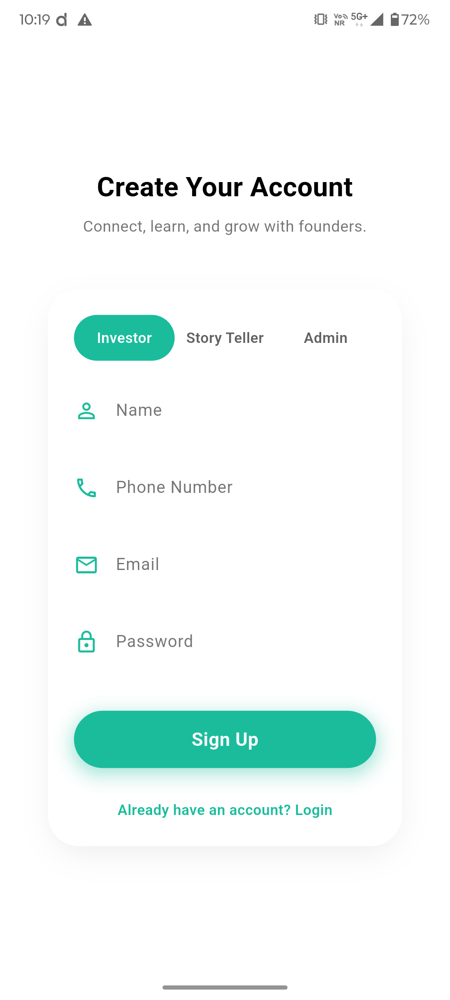
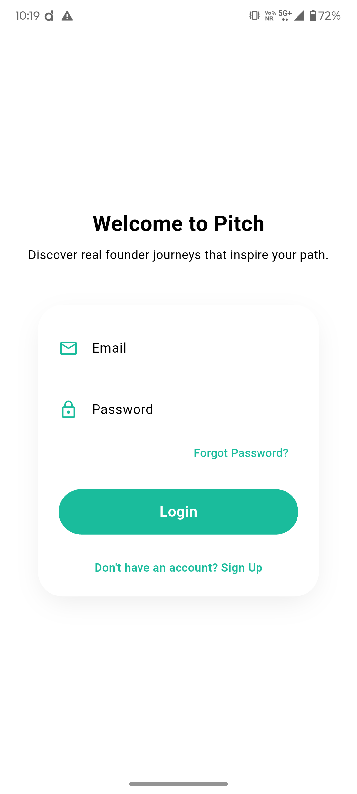
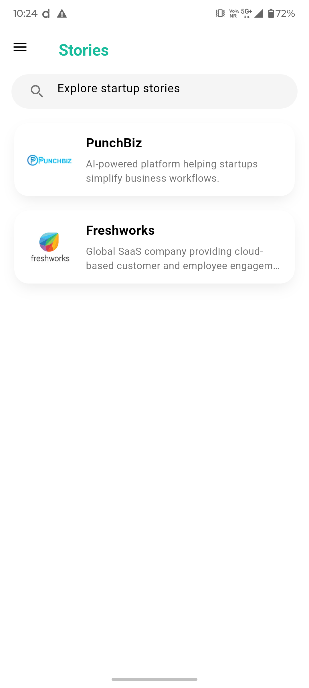
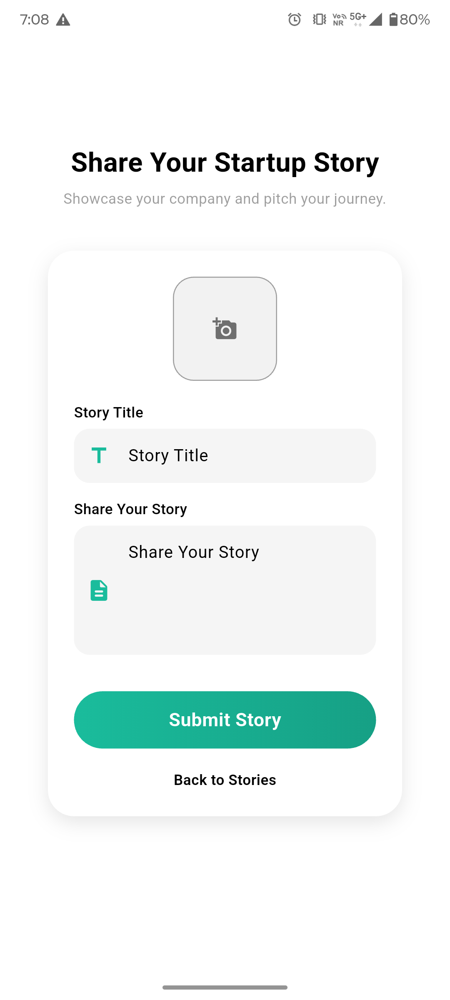

# 🚀 Pitch
### *Where Startup Storytelling Meets Strategic Investment*

**Pitch** is a dedicated ecosystem designed to bridge the gap between visionary founders and strategic investors. By providing a structured platform for brand storytelling, Pitch enables startups to go beyond the "deck" and share their complete journey, vision, and mission in a centralized digital space.

## 📌 The Problem
Early-stage founders face a fragmented landscape when trying to build brand equity:
* **Visibility Vacuum:** High-potential startups get lost in the noise of general social media.
* **Fragmented Pitching:** No dedicated space for continuous, narrative-driven storytelling.
* **High Friction:** Difficulty in finding and engaging with verified investors in a structured environment.

## 💡 The Solution
Pitch offers a narrative-first approach to fundraising and brand building. It serves as a digital stage where founders showcase their roadmap and investors discover the "why" behind the business.

### 📷 Prototype

<div align="center" style="display: flex; justify-content: center; align-items: flex-start; gap: 10px; flex-wrap: nowrap;">
  
  
  
  
  
</div>

## 🎯 Key Features

### 👤 Role-Based Ecosystem
The platform utilizes **Role-Based Access Control (RBAC)** to ensure a tailored experience:
* **Admin:** Oversees platform integrity and monitors activity.
* **Storyteller (Founder):** Creates, edits, and manages the startup’s narrative.
* **Investor/User:** Explores curated stories, follows progress, and connects with founders.

### 📝 Strategic Story Management
Founders can build comprehensive profiles including:
* **Core Pillars:** Vision, Mission, and Founder backgrounds.
* **Media Integration:** Support for high-quality imagery to bring the brand to life.
* **Dynamic Updates:** Real-time ability to add, edit, or delete story elements as the startup evolves.

### 💳 Monetization & Growth
* **Premium Access:** Integrated payment gateways to unlock promotional features.
* **Verified Profiles:** Secure authentication via Firebase to ensure data integrity.
* **Search & Discovery:** Advanced filtering to find startups by name or industry.

## 🏗️ Technical Architecture
Pitch is built with a **modular, scalable architecture** designed to handle high-traffic data management and secure media storage.

| Layer | Technology | Purpose |
| :--- | :--- | :--- |
| **Frontend** | **Flutter** | High-performance, cross-platform mobile UI |
| **Auth** | **Firebase Auth** | Secure login and session management |
| **Database** | **Cloud Firestore** | Real-time, scalable NoSQL data storage |
| **Storage** | **Cloud Storage** | Secure hosting for brand assets and images |
| **Security** | **Firebase Rules** | Granular, role-based data protection |

## 🚀 Future Roadmap
* 💬 **Direct Connect:** Real-time messaging between investors and founders.
* 📈 **Founder Analytics:** Track engagement metrics and investor interest.
* 🤖 **AI Recommendations:** Matching investors to startups based on sector preference.
* 🛡️ **Investor Verification:** An onboarding tier for accredited investors.
  
## 🛠️ Installation & Setup

1. **Clone the repository**
   ```bash
   git clone https://github.com/Akilesh-GA/Pitch.git
   cd pitch
   flutter pub get
   flutter run
   
